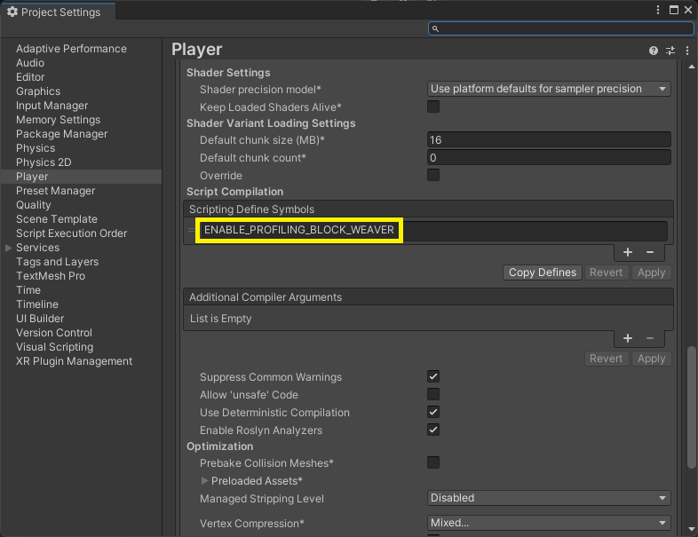
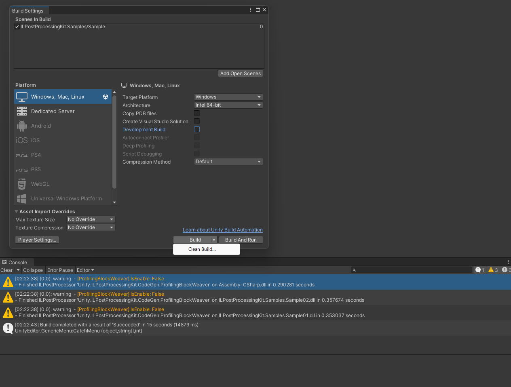
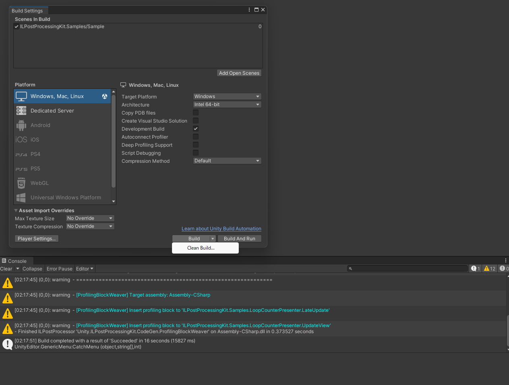

# ILPostProcessingKit
ILPostProcessor for Unity

## ProfilingBlockWeaver
### C# (original source code)
```cs
using UnityEngine;
using UnityEngine.UI;

namespace ILPostProcessingKit.Samples
{
    public class LoopCounterPresenter : MonoBehaviour
    {
        [SerializeField] Text _countViewA;
        [SerializeField] Text _countViewB;
        [SerializeField] Sample01.LoopCounter01A _counterA;
        [SerializeField] Sample01.LoopCounter01B _counterB;

        void LateUpdate()
        {
            UpdateView();
        }

        void UpdateView()
        {
            _countViewA.text = $"FrameCount: {_counterA.LoopCount}";
            _countViewB.text = $"OddFrames: {_counterB.OddFrameCount}, EvenFrames: {_counterB.EvenFrameCount}";
        }
    }
}
```

### IL (ProfilingBlockWeaver is not applied)
```
.class public auto ansi beforefieldinit ILPostProcessingKit.Samples.LoopCounterPresenter
	extends [UnityEngine.CoreModule]UnityEngine.MonoBehaviour
{

    ...

	// Methods
	.method private hidebysig 
		instance void LateUpdate () cil managed 
	{
		// Method begins at RVA 0x2050
		// Header size: 1
		// Code size: 9 (0x9)
		.maxstack 8

		IL_0000: nop
		IL_0001: ldarg.0
		IL_0002: call instance void ILPostProcessingKit.Samples.LoopCounterPresenter::UpdateView()
		IL_0007: nop
		IL_0008: ret
	} // end of method LoopCounterPresenter::LateUpdate

    ...

} // end of class ILPostProcessingKit.Samples.LoopCounterPresenter
```

### IL (ProfilingBlockWeaver is applied)
```
.class public auto ansi beforefieldinit ILPostProcessingKit.Samples.LoopCounterPresenter
	extends [UnityEngine.CoreModule]UnityEngine.MonoBehaviour
{

    ...

    // Methods
    .method private hidebysig 
        instance void LateUpdate () cil managed 
    {
        // Method begins at RVA 0x2050
        // Header size: 12
        // Code size: 25 (0x19)
        .maxstack 1

        IL_0000: ldstr "ILPostProcessingKit.Samples.LoopCounterPresenter.LateUpdate"
        IL_0005: call void [UnityEngine.CoreModule]UnityEngine.Profiling.Profiler::BeginSample(string)
        .try
        {
            IL_000a: nop
            IL_000b: ldarg.0
            IL_000c: call instance void ILPostProcessingKit.Samples.LoopCounterPresenter::UpdateView()
            IL_0011: nop
            IL_0012: ret
        } // end .try
        finally
        {
            IL_0013: call void [UnityEngine.CoreModule]UnityEngine.Profiling.Profiler::EndSample()
            IL_0018: endfinally
        } // end handler
    } // end of method LoopCounterPresenter::LateUpdate

    ...

} // end of class ILPostProcessingKit.Samples.LoopCounterPresenter
```

### C# (decompiled source code)
```cs
// Assembly-CSharp, Version=0.0.0.0, Culture=neutral, PublicKeyToken=null
// ILPostProcessingKit.Samples.LoopCounterPresenter
using ILPostProcessingKit.Samples.Sample01;
using UnityEngine;
using UnityEngine.Profiling;
using UnityEngine.UI;

public class LoopCounterPresenter : MonoBehaviour
{
    [SerializeField]
    private Text _countViewA;

    [SerializeField]
    private Text _countViewB;

    [SerializeField]
    private LoopCounter01A _counterA;

    [SerializeField]
    private LoopCounter01B _counterB;

    private void LateUpdate()
    {
        Profiler.BeginSample("ILPostProcessingKit.Samples.LoopCounterPresenter.LateUpdate");
        try
        {
            UpdateView();
        }
        finally
        {
            Profiler.EndSample();
        }
    }

    private void UpdateView()
    {
        Profiler.BeginSample("ILPostProcessingKit.Samples.LoopCounterPresenter.UpdateView");
        try
        {
            _countViewA.text = $"FrameCount: {_counterA.LoopCount}";
            _countViewB.text = $"OddFrames: {_counterB.OddFrameCount}, EvenFrames: {_counterB.EvenFrameCount}";
        }
        finally
        {
            Profiler.EndSample();
        }
    }
}
```

### Setup
Add settings file.

`Assets/_ILPostProcessingKit/ProfilingBlockWeaverSettings.json`
```json
// Example of ProfilingBlockWeaverSettings.json
{
    "TargetAssemblyNamePatterns": [
        "Assembly-CSharp",
        "ILPostProcessingKit.Samples*"
    ],
    "TargetInfoList": [
        {
            "IsBaseType": true,
            "TypeName": "MonoBehaviour",
            "MethodNames": [
                "Update",
                "FixedUpdate",
                "LateUpdate"
            ]
        },
        {
            "IsBaseType": false,
            "TypeName": "LoopCounterPresenter",
            "MethodNames": [
                "UpdateView"
            ]
        }
    ]
}
```

Add define symbol.



### Build




